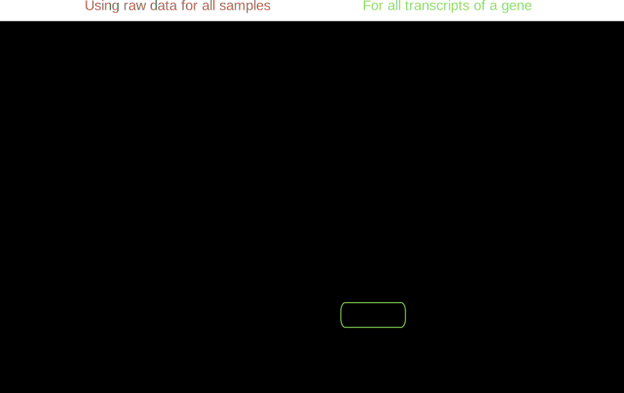

# Module Overview

The NanoIso tool is split into two similar but smaller pipelines: processing. The processing part maps, aligns, and quantifies raw ONT reads. The analysis part .

The tool is constructed in a way that it can be run independently, or in combination.

Below is an over schematic diagram of the modules.

