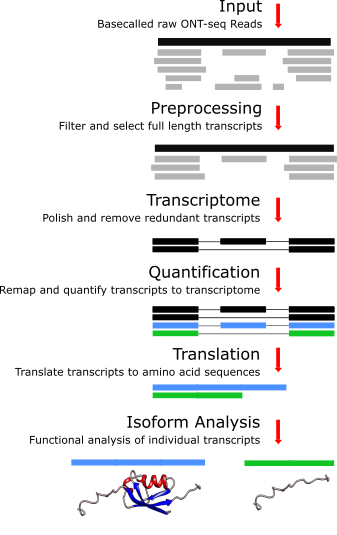

# Module Overview

The NanoIso tool can be split into two smaller pipelines: processing. The processing part, which maps, aligns, and quantifies raw ONT reads and creates a *de novo* transcriptome. The analysis part analyzes transcriptional and functional changes for isoforms for individual genes.

The tool is constructed in a way that so that each individual part can be run independently, or together in combination. However, the tool has been optimized to run the processing and analysis part separately.

Below is an over schematic diagram of the modules.

